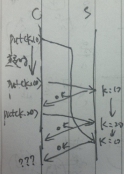

## 第2讲：基础架构（Infrastructure）：RPC和线程

### RPC：远程过程调用
* 分布式系统中一个关键的环节，所有的实验都使用了RPC
* 目标：可以简单的编写网络通信程序
    * 隐藏客户端和服务器通信的大部分细节
    * 客户端可以像调用本地过程一样执行RPC
    * 在服务器上执行的代码称为handler，它们对于客户端就像是本地的过程一样
* RPC被广泛应用

* RPC的设计思想是把网络通信像函数调用那样执行，把网络通信处理成透明的：
```
客户端
    z = fn(x, y)

服务器 
    fn(x, y) {
        compute
        return z
    }
```

* 实验1中的RPC：
    * DoJob
    * Register

* RPC的信息流图：
```
客户端    服务器
请求->
          <-响应
```

* 使用RPC的软件架构：
```
客户端应用软件   handler（RPC调用的服务端函数）
    stubs        事件派发器
    RPC库        RPC库
    网络   ---   网络
```

* 一些细节：
    * 服务器如何知道客户端调用了自己的哪个handler？
    * 序列化：把数据格式化成网络包
        1. 对于数组、指针、对象等数据不容易格式化（tricky）
        2. Go的RPC库相当强大
        3. 不能通过序列化传递的参数：通道、函数
    * 绑定：客户端如何知道RPC的服务器在哪里？
        1. 通过服务器的主机名
        2. 通过名字服务将服务名映射到最佳的服务器主机名
    * 线程：
        1. 客户端通常有许多线程，如果多个线程调用了RPC，服务器的响应需要匹配到发送RPC请求的线程（so > 1 call outstanding, match up replies）
        2. handler可能运行速度很慢，所以服务器通常对于每个RPC请求分配一个单独的线程运行

### RPC的问题：失败了怎么处理？
例：丢包、网络中断、服务器响应慢、服务器宕机。

对于客户端的RPC库，RPC调用失败表现为**收不到服务器的响应**，此时客户端**不知道**服务器是不是接收到了请求，可能（接收到了请求但是）在发送响应之前服务器或者网络出现了故障。    

#### 最简单的RPC行为模型：“最少一次”

流程：

  1. RPC库等待响应一段时间
  2. 如果在指定时间内没有响应到达，重传请求
  3. 重复上述过程若干次
  4. 如果还是没有收到相应，向应用程序返回错误

Q：“最少一次”模型对于应用程序来说容易处理吗？
    
考虑一个最简单的问题：客户端发送“从银行账户中扣款10美元”。
（译者注：应用程序不好处理，如果是服务器已经执行了扣款操作，但是响应丢失，客户端会重复扣款请求，则账户再次扣了20美元。）

Q：这一模型会客户端程序出现什么错误？

  1. Put("k", 10)：RPC调用，将数据库服务器中的"k"键的值设置为10
  2. Put("k", 20)：客户端对同一个键进行第二次设置
    
图：超时、重传、第一次请求延迟（以下为译者的分析）

第一次请求延迟：请求没有丢，而是在某个节点延迟了，导致客户端RPC超时重传。然后两个请求依次被处理。此时第一次被延迟的请求到达服务器，服务器错误的执行后改写了"k"键的值。



Q：“最少一次”模型适用的场景？

  * **幂等操作**，例如读操作
  * 应用程序自己处理重复操作，例如MapReduce中的后备任务

#### 更好的RPC行为模型：“最多一次”
思想：服务器检查重复的请求，直接返回之前执行的结果，而不是再次执行。

Q：如何检测重复的请求？
  客户端的每个请求通过不重复的ID（XID aka unique id）标记，重传时使用相同的UID。服务器伪代码：
```
if seen[xid]:
    r = old[xid]
else:
    r = handler()
    old[xid] = r
    seen[xid] = true
```

“最多一次”模型的带来的复杂性：

  * 从实验2开始会逐渐遇到这些复杂性。
  * 如何确保xid是唯一的？
      1. 大的随机数
      1. 通过客户端id（例如ip地址）+请求序号构造       
  * 服务器最终需要丢弃已完成的RPC的信息：
      * 何时丢掉是安全的？想法：
          1. 通过惟一的客户端id和每个客户端的RPC请求序号，客户端在发送RPC请求时附带“已经接收到响应的最大连续序号”，类似TCP的seq和ack。
          2. 只允许客户端每次发送一个RPC，服务器接收到序号为seq+1的请求时，服务器丢弃seq及以前的结果。
          3. 客户端保持重试最长5分钟，服务器丢弃5分钟之前的所有已完成RPC的信息。
      * 如何处理在一个请求正在执行时接收到重复的请求？想法：
          1. 服务器此时没有得到请求执行的结果，也不想执行两次。
          2. 可以为RPC增加“挂起”状态标志，或者等待第一次执行结束，或者忽略重复的请求。

* 如果“最多一次”的服务器宕机并且重启会对这一模型有何影响？
    * 如果已完成的RPC信息保存在内存中，那么服务器重启后会忘记自己之前执行过的RPC请求，并重接接收并处理。
    * 或许需要把RPC的结果写入磁盘？
    * 或许服务器可以双机备份已完成的RPC信息？

* “精确执行一次”模型？实验3会讨论“最多一次”+“无限重试”+“容错性服务”

* Go的RPC是“至多一次”的模型：
    1. 打开TCP连接
    2. 通过TCP连接发送请求
    3. TCP可能重传请求，但服务器的TCP会过滤重复的TCP报文
    4. Go的代码中没有应用层的重传（例如：不会再建立第二个TCP连接）
    5. Go的RPC在得不到响应时会回复一个错误，错误可能原因：
        * TCP连接超时
        * 服务器没有收到请求
        * 服务器处理了请求但是在返回响应时服务器或者网络故障了

* Go的“至多一次”模型对于实验1是不够的：
    * Go只调用一次RPC
    * 如果worker没有响应，master把任务重传到另一个worker，但是原来的worker可能并没有故障，而是还在执行任务中
    * Go的RPC无法检测到这种重复：实验1是没问题的，因为应用层对它进行了处理，实验2将会显式的检测重复

### 线程：
1. 线程是服务器的结构化工具
2. 在实验中会经常用到它
3. 线程会有很多坑（tricky）
4. 线程经常和RPC一起使用
5. 在Go中线程叫做goroutines，其他的地方都叫线程（译者注：协程和线程不是一回事）

<!--你看不到我，凭空破列表-->

* 线程是“thread of control”
    * 线程允许一个程序在逻辑上同时做很多事
    * 线程共享进程内存
    * 每个线程的状态是独有的：PC、寄存器、栈

* 线程的挑战：阅读toy RPC包的代码，回答下面的问题。
    * 共享数据
        1. 竞争问题：两个线程同时修改同一个数据或者一个线程在读数据时另一个线程修改同一个数据
        2. 需要对共享数据进行保护
        3. Go中的sync.Mutex
    * 线程间同步：例如等待所有map任务完成，Go中的channels
    * 死锁：线程1等待线程2，线程2等待线程1。比竞争更容易检测
    * 锁的粒度：
        1. 粗粒度的锁简单，但是并发性差
        2. 细粒度的锁在提高并发性的同时增加了竞争和死锁的可能

### 这节课的讲义：l-rpc.go
1. 简单的RPC系统
2. 展示了线程、互斥量、通道
3. 尽管它可以运行，但是它是个玩具：假定连接已打开，只支持整数参数和响应，忽略错误检测。 

#### ToyClient结构体
* 客户端RPC的状态
* 每个ToyClient一个互斥锁
* 与服务器的连接（TCP套接字）
* xid：每次RPC调用的唯一ID，用于匹配接收到的响应
* pending[]：每个线程的等待响应队列，客户端在接收到响应时可以唤醒对应的进程

#### Call()
* 应用程序的调用：reply := client.Call(procNum, arg)
    * procNum：指定调用服务器上哪个函数
* WriteRequest知道RPC消息的格式，就是把参数转换成报文中的二进制位
* Q：
    1. 为什么Call()需要互斥锁，mu.Lock()的作用是什么？
    2. 能否把xid := tc.xid移到临界段之外？毕竟这样并没有改变任何东西
    3. WriteRequest需要在临界段之中吗？注意：Go语言中map操作不是线程安全的，这是更新挂起需要上锁的原因。
    4. 回复马上就接收到了怎么处理？Listener()在pending[xid]被创建之前或者是caller阻塞在channel之前就接收到了回复。
    5. 能不能把reply := <-done放在临界段外面？为什么有两个线程使用它的情况下，放在外面也是可以的？
    6. 为什么每个ToyClient一个互斥锁，而不是每个RPC调用一个互斥锁呢？

#### Listener()：
* 作为后台线程运行
* Q：
    1. <-的作用是什么？
    2. 为什么对于每个调用可能需要等待在channels上是不对的？（not quite right that it may need to wait on chan for caller）

#### Dispatcher()（服务器的事件派发器）：
* 注意：派发器把xid回复给客户端，这样Listener就知道唤醒哪个调用线程了。
* Q：
    1. 为什么在一个单独的线程中运行handler？
    2. 派发器乱序回复可以吗？

#### main()
* 注意：注册handler在handler[]中（note registering handler in handlers[]）
* Q：程序会打印什么？
* Q：什么时候使用channels，什么时候使用共享内存+锁？我的观点如下：
    1. 它们基本上是等价的，并且都很常用。
    2. channels：一个线程显式的等待另一个，常见的客户端等待结果或者服务器等待下一个请求，例如客户端调用Call()以后等待Listener()唤醒。
    3. 共享内存+互斥锁：线程之间并不是显式的发生直接作用，但是仅仅是会读写相同的数据。例如Call()使用tc.xid。

* Go的内存模型需要显式的同步实现通信：
    * 下面的代码是不对的，写出这样的代码是很有诱惑力的，但是Go的标准说它的运行结果是未定义的，需要使用channel或者sync.WaitGroup代替
    * 译者注：就是不能用个变量作为同步标志。如果这个变量是加锁的呢？
```go
var x int
done := false
go func() { x = f(...); done = true; }
while done == false {}
```
    
* 学习Go指南中的goroutines和channels。

###附
```go
package main

//
// toy RPC library
//

import "io"
import "fmt"
import "sync"
import "encoding/binary"

type ToyClient struct {
  mu sync.Mutex
  conn io.ReadWriteCloser      // connection to server
  xid int64                    // next unique request #
  pending map[int64]chan int32 // waiting calls [xid]
}

func MakeToyClient(conn io.ReadWriteCloser) *ToyClient {
  tc := &ToyClient{}
  tc.conn = conn
  tc.pending = map[int64]chan int32{}
  tc.xid = 1
  go tc.Listener()
  return tc
}

func (tc *ToyClient) WriteRequest(xid int64, procNum int32, arg int32) {
  binary.Write(tc.conn, binary.LittleEndian, xid)
  binary.Write(tc.conn, binary.LittleEndian, procNum)
  binary.Write(tc.conn, binary.LittleEndian, arg)
}

func (tc *ToyClient) ReadReply() (int64, int32) {
  var xid int64
  var arg int32
  binary.Read(tc.conn, binary.LittleEndian, &xid)
  binary.Read(tc.conn, binary.LittleEndian, &arg)
  return xid, arg
}

//
// client application uses Call() to make an RPC.
// client := MakeClient(server)
// reply := client.Call(procNum, arg)
//
func (tc *ToyClient) Call(procNum int32, arg int32) int32 {
  done := make(chan int32) // for tc.Listener()

  tc.mu.Lock()
  xid := tc.xid  // allocate a unique xid
  tc.xid++
  tc.pending[xid] = done  // for tc.Listener()
  tc.WriteRequest(xid, procNum, arg)  // send to server
  tc.mu.Unlock()

  reply := <- done  // wait for reply via tc.Listener()

  tc.mu.Lock()
  delete(tc.pending, xid)
  tc.mu.Unlock()

  return reply
}

//
// listen for replies from the server,
// send each reply to the right client Call() thread.
//
func (tc *ToyClient) Listener() {
  for {
    xid, reply := tc.ReadReply()
    tc.mu.Lock()
    ch, ok := tc.pending[xid]
    tc.mu.Unlock()
    if ok {
      ch <- reply
    }
  }
}

type ToyServer struct {
  mu sync.Mutex
  conn io.ReadWriteCloser  // connection from client
  handlers map[int32]func(int32)int32  // procedures
}

func MakeToyServer(conn io.ReadWriteCloser) *ToyServer {
  ts := &ToyServer{}
  ts.conn = conn
  ts.handlers = map[int32](func(int32)int32){}
  go ts.Dispatcher()
  return ts
}

func (ts *ToyServer) WriteReply(xid int64, arg int32) {
  binary.Write(ts.conn, binary.LittleEndian, xid)
  binary.Write(ts.conn, binary.LittleEndian, arg)
}

func (ts *ToyServer) ReadRequest() (int64, int32, int32) {
  var xid int64
  var procNum int32
  var arg int32
  binary.Read(ts.conn, binary.LittleEndian, &xid)
  binary.Read(ts.conn, binary.LittleEndian, &procNum)
  binary.Read(ts.conn, binary.LittleEndian, &arg)
  return xid, procNum, arg
}

//
// listen for client requests,
// dispatch each to the right handler function,
// send back reply.
//
func (ts *ToyServer) Dispatcher() {
  for {
    xid, procNum, arg := ts.ReadRequest()
    ts.mu.Lock()
    fn, ok := ts.handlers[procNum]
    ts.mu.Unlock()
    go func() {
      var reply int32
      if ok {
        reply = fn(arg)
      }
      ts.mu.Lock()
      ts.WriteReply(xid, reply)
      ts.mu.Unlock()
    }()
  }
}

type Pair struct {
  r *io.PipeReader
  w *io.PipeWriter
}
func (p Pair) Read(data []byte) (int, error) {
  return p.r.Read(data)
}
func (p Pair) Write(data []byte) (int, error) {
  return p.w.Write(data)
}
func (p Pair) Close() error {
  p.r.Close()
  return p.w.Close()
}

func main() {
  r1, w1 := io.Pipe()
  r2, w2 := io.Pipe()
  cp := Pair{r : r1, w : w2}
  sp := Pair{r : r2, w : w1}
  tc := MakeToyClient(cp)
  ts := MakeToyServer(sp)
  ts.handlers[22] = func(a int32) int32 { return a+1 }

  reply := tc.Call(22, 100)
  fmt.Printf("Call(22, 100) -> %v\n", reply)
}
```
