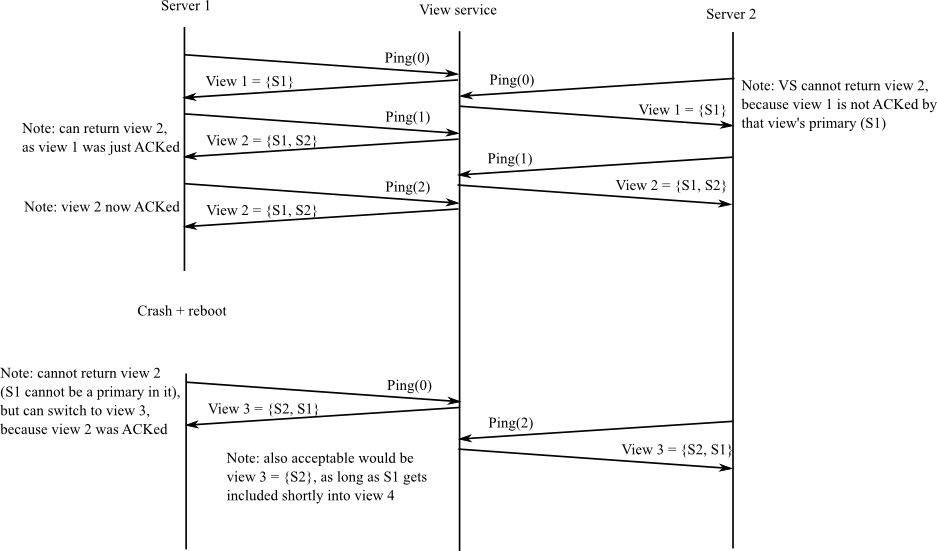

## Lab 2： 主/备k-v服务
### 1 简介
mapreduce实验中错误处理是很简单的，因为worker是无状态的，状态由master维护，但是我们没有要求master的容错性。实验2向有状态服务的容错性迈出了第一步。

### 2 实验2-5路线图
在接下来的4个实验中，你会实现若干个k-v服务，这些服务支持三个RPC：Put(key, value)、Append(key, arg)和Get(key)。服务维护了一个简单的k-v键值对的数据库，Put()替换数据库中某个key的value，Append()向key的value追加arg，Get()获得一个key当前的value。

这些实验的区别在于k-v服务的容错性和性能：

* 实验2使用主/备冗余，viewservice用于决定哪个机器是正常的。viewservice允许主/备服务在不同网段也能正常工作（network partition）。viewservice本身没有副本，因此它是个故障的单点。
* 实验3使用paxos协议对k-v服务做冗余，从而实现没有单点故障，并且能够正确的处理划分网段。这种k-v服务比无副本的k-v服务响应速度慢，但是具有容错性。
* 实验4是一个分片的（sharded）的k-v数据库，每个分片使用paxos对自己的状态做副本。这个k-v服务能够在不同的分片上并行的进行Put/Get操作，这一特性适合mapreduce这类对存储系统有较高负载压力的应用。除此之外，实验4还有一个带副本的配置服务，用于告诉每个分片存储的key的范围。这个服务可以改变分片中key的分配，例如响应动态变化的负载。实验4是真实世界中一个1000+服务器的设计原型。
* 实验5在实验4中增加了持久性，一个k-v服务器可以从宕机中恢复并重新加入到它所在的冗余组中（replica group）。

每个实验中你会做大量的设计，我们提供了整体涉及的框架代码（以及一些乏味功能的实现代码），要求你填充框架中缺失的部分并制定完整的通信协议（nail down a complete protocol）。测试用例对容错性、服务正确性以及性能进行测试，对于测试中暴露的问题，需要你重新进行设计和实现。仔细的思考和计划可以帮助你减少重复次数。我们不提供测试用例的描述（但是提供测试用例的Go源码），在真实世界中，测试用例应该是由你自己想出来。

### 3 实验2概览
这个实验中你会实现一个k-v服务，通过主/备冗余的方式实现容错性。为了确保所有的参与者（客户端和服务器）对于谁是主机谁是从机达成一致，我们引入一个viewservice，它是一种master服务器。这个服务监控所有服务器存活状态，如果当前的主机或者从机宕机了，viewservice会重新选择一个服务器替代它。客户端通过viewservice获得当前的主机。所有的服务器都和viewservice交互，确保同一个时间只有最多一个可用的主机。

你实现的k-v服务需要允许替换故障的服务器。如果主机故障了，viewservice会把从机升级为主机。如果从机故障了或者从机升级为主机，并且有一个空闲可用的服务器，viewservice会把它作为新的从机。主机会把它的全部数据库发送到新的从机，并且把所有的Put操作也发送给从机，确保从机上的k-v数据库和主机上保持一致。

主机必须向从机发送Get和Put操作，并且必须等待从机应答以后才能把结果返回给客户端。这样是为了避免两个服务器都作为主机（分裂的大脑）。例如：S1是主机，S2是从机。viewservice错误的判断S1宕机了，因此把S2提升为主机。此时一个客户端还认为主机是S1并相它发送了请求，S1会把请求转发给S2（译者注：因为S2是从机，主机会把请求转发给从机），因为S2已经被viewservice提升为主机了，因此它向S1返回错误。S1会向客户端返回错误，告诉客户端S1可能不是主机了（因为S2拒绝了请求），客户端会向viewservice请求新的主机（即S2），然后向它发送请求。

故障的k-v服务器可能重启，但是重启后不会备份数据（but it will do so without a copy of the replicated data）。数据保存在你的k-v服务器内存中而不是硬盘，这样做的结果是如果没有从机并且主机宕机了，主机重启后就不能再作为主机了（译者注：因为主机内存中的数据丢失了，并且没有从机）。

不同客户端之间、服务器之间以及客户端和服务器之间只能使用RPC通信。服务器的不同实例不允许共享Go的变量或者文件。

上面的设计有一定的容错性和性能局限，真实世界中很少使用：
* viewservice容易故障，因为它是单点
* 主机和从机只能逐个处理请求，限制了系统性能
* 从机服务器必须从主机拷贝完整的k-v数据库，这个时间可能很长，机器从机服务器和主机上的数据几乎是一致的（比如：因为短时间的网络连接故障丢失了几分钟内的更新操作）。
* 服务器不在磁盘上保存k-v数据库，所以主机和从机同时宕机时就无法恢复（例如：整个网站机房停电）。
* 如果有一个临时的问题阻止了主机和从机之间的通信，系统有两种解救办法：viewservice消除从机服务器，或者是（主机不断）重试。这两种方法在这个问题频发时都不能很好的解决。
* 如果主机在viewservice知道哪个是主机之前就宕机了，viewservice就没法继续了，它会一直循环（等待主机通知）并且不能主动更新主机。

我们会在后面的实验中通过优化设计和协议来处理这些局限（address these limitations），本次实验会帮助你理解后面实验需要解决的问题。

这个实验中的主/备模型没有可以参考的已经公布的原型，这个实验也没有制定一个完整的系统原型，你必须自己来完善细节。这个实验的原型和Flat Datacenter Storage有些类似（viewservice和FDS的metadata是类似的，主/备服务器和FDS的tract服务器也很相像），但是FDS对于提高性能进行了很多的考虑。这个实验和MongoDB的副本集合也有一些类似（但是MongoDB使用类paxos选举算法选主）。更多关于主/备原型的详细描述，请参考[Chain Replication](http://www.cs.cornell.edu/home/rvr/papers/osdi04.pdf)。Chain Replication比实验2有更好的性能表现，though it assumes that the view service never declares a server dead when it is merely partitioned。关于高性能的主/备设计的细节以及在各种故障下恢复系统状态，请参考Harp and Viewstamped Replication。

### 4 合作政策（略）

### 5 软件
使用git pull获取最新的实验代码，我们提供了实验2的框架代码和测试在src/viewservice和src/pbsrevice。

忽略methd Kill错误信息，测试失败是因为viewservice/server.go的RPC handler为空。

你也可以（不运行测试）单独启动程序，相关的代码为main/viewd.go、main/pbd.go和main/pbc.go，请阅读pbc.go中的注释。

```shell
$ add 6.824
$ cd ~/6.824
$ git pull
...
$ cd src/viewservice
$ go test
2012/12/28 14:51:47 method Kill has wrong number of ins: 1
First primary: --- FAIL: Test1 (1.02 seconds)
        test_test.go:13: wanted primary /var/tmp/viewserver-35913-1, got 
FAIL
exit status 1
FAIL    _/afs/athena.mit.edu/user/r/t/rtm/6.824/src/viewservice 1.041s
$
```

### 6 Part A：viewservice

首先你需要实现一个viewservice，并确保它通过我们的测试，Part B中你会构建k-v服务。你的viewservice没有冗余，所以它会相对比较简单。Prat B比Part A难的多，因为k-v服务是冗余的，你需要设计很多冗余相关的协议。

viewservice检查一系列的编号的view，view由序号和主机和从机的身份（端口号）组成。

在view中主机必定是主机或者上一个view的从机，这是的确保k-v服务的状态能够被保存，除了当viewservice启动时，任何先到达的服务器会被作为第一个主机。view中的从机可以是除了主机以外的任何从机，当没有服务器都不可用时，view里面也可能没有从机（用一个空字符串表示）。

每个k-v服务器需要以PingInterval周期向viewservice发送Ping RPC（见viewservice/common.go），viewservice回复当前view的描述。Ping的作用如下；

* viewservice知道k-v服务器是存活的
* k-v服务器知道当前的view
* viewservice知道在k-v服务器保存的最近的view

如果viewservice持续DeadPings个PingIntervals都没接收到k-v服务器的Ping，viewservice会认为这个服务器不可用。当服务器重启后，它会发送参数为0的Ping，让viewservice知道自己之前宕机了。

viewservice在下面几种情形中会转换到新的view：

* viewservice接收不到主机和从机的Ping
* 主机或者从机宕机重启
* view中没有从机，并且有一个服务器是空闲的（服务器既不是主机也不是从机，并且正在向viewservice发送Ping）

只有当目前的view中的主机确认自己的view和viewservice的当前view一致时（主机Ping返回的view序号和当前的view相等），viewservice才能转换到新的view（向Ping的调用者返回一个不同的view）。如果viewservice没有接收到当前view的主机的确认，即使viewservice认为主机已经宕机了，也不能转换到新的view。假设当前view的序号为X，如果viewservice没有接收到view X的主机的Ping(X)请求，viewservice不能从view X转换到view X+1。

（上面的）应答机制防止viewservice的view序号超前于k-v服务器，如果viewservice可以随意的递增view，那么需要复杂的设计保存view的历史，然后k-v服务器还需要请求历史的view。应答机制的缺点是如果主机在它确认它是主机的view之前宕机了，viewservice就不能转换到新的view。

一个view变换序列的例子：



上面的例子是overspecified，例如：当viewservice第一次接收到S1的Ping(1)，返回view 1也是可以的，只要最终viewservice能够转换到view 2（、包含S2）。

我们提供的client.go是完整的，common.go中定义了合适的RPC，你的工作是完成server.go，完成的标志是通过viewservice所有的测试；
```shell
$ cd ~/6.824/src/viewservice
$ go test
Test: First primary ...
  ... Passed
Test: First backup ...
  ... Passed
Test: Backup takes over if primary fails ...
  ... Passed
Test: Restarted server becomes backup ...
  ... Passed
Test: Idle third server becomes backup if primary fails ...
  ... Passed
Test: Restarted primary treated as dead ...
  ... Passed
Test: Viewserver waits for primary to ack view ...
  ... Passed
Test: Uninitialized server can't become primary ...
  ... Passed
PASS
ok      viewservice     7.457s
$
```

上面的输出忽略了一些Go rpc的不影响viewservice功能的错误（benign Go rpc errors）。

提示：

1. 可以向server.go中的ViewServer中添加一个字段记录viewservice从每个server接收到最近一次Ping的时间。map[server_name]time.Time或许是一种可行的数据结构，当前时间可以通过time.Now()来获取。
1. ViewServer需要增加一个字段记录当前的view
1. 需要在PingArgs.Viewnum中记录是否当前view的主机向viewservice确认了自己是主机
1. viewservice需要周期性的决策，例如：当主机丢失的Ping数量超过DeadPings，要把从机提升为主机。在tick()中添加这些代码，tick()函数以PingInterval为周期被调用。
1. 可能发送Ping的服务器数量多于2台，除了主机和从机以外的服务器可以按照志愿成为从机来处理。
1. viewservice需要能够检测主机或者从机宕机以及重启，比如：主机可能宕机了，然后在发送下一次Ping之前很快的重启了。
1. 在启动viewservice程序前先研究一下测试用例，如果某个测试用例失败了，你需要阅读一下test_test.go中的代码，找到故障的场景。
1. 最简单的追查问题的方法是插入log.Printf()语句，通过go test > out收集输出到一个文件中，然后分析输出和你预期的代码行为是不是一致。
1. Go的RPC服务器框架对每个接收到的RPC请求都开启一个线程，如果多个RPC同时到达（来自多个客户端），服务器中会有多个线程同时执行。
1. 测试用例通过设置server的dead标志来杀死它，你必须确保服务器在设置了这个标志以后真的终止了（会在isdead()中测试），否则不能通过所有的测试用例。

### 7 Part B：主/备k-v服务

主/备k-v服务的代码在pbservice中，pbservice/{client.go,server.go}分别是我们提供的一部分客户端接口和一部分服务器代码。客户端首先创建一个Clerk对象，然后调用它的方法向服务器发送RPC，从而使用k-v服务。

你的k-v服务需要能够持续正确运行，只要不是所有服务器都宕机了。当服务器发生暂时网络故障时，服务器本身没有宕机，只能和一部分其他服务器通信，k-v服务也要能够正确运行。如果k-v服务只运行在一台服务器上，k-v服务需要能够并入重启的或者空闲的服务器（作为从机），这样才能对服务器故障进行容错。

k-v服务正确运行的衡量标准：调用Clerk.Get(k)返回最近一次成功调用Clerk.Put(k,v)或者Clerk.Append(k,v)的键值，如果键不存在则返回空值。所有的操作需要遵循“最多一次”的语意（见第2讲和第3讲）。

假定viewservice不会阻塞或者宕机。

客户端和服务器之间只能用RPC通信，使用client.go中定义的call()函数发送RPC请求。

任意一个时间只能有一个主机是可用的，这一点很重要。你可以自己发现一个具体场景用于分析为什么需要设计单主机。一个危险的场景：假定在某个view中S1是主机，viewservice更新view使得S2成为主机，但是S1还不知道view更新，并且还认为自己是主机。于是一部分客户端可能和S1在通信，另一部分和S2通信，S1和S2不知道对方的Put()操作。

不是主机的服务器，要么不响应客户端，要么向客户端返回错误（设置GetReply.Err或者PutReply.Err，就是不能返回OK）。

Clerk.Get()、Clerk.Put()和Clerk.Append()只有在完成了操作以后才能返回。因此Put()和Append()需要不停的重试，直到它们更新了k-v数据库，Get()需要不停的重试，直到获得了当前key的value。服务器需要过滤掉客户端重复发送的RPC，确保操作的“最多一次”语意。你可以假定每个clerk都只有一个暴露出来的（outstanding）Put或者Get，请仔细考虑Put提交的位置在哪里最合适。

服务器并不是每个Put/Get都和viewservice通信，因为这会使得viewservice在性能和容错性的临界点。服务器应该周期的向viewservice发送Ping获取最新的view（在pbservice/server.go的tick()函数中）。同样，客户端也不应该每个RPC都和viewservice通信，而是应该在Clerk对象中缓存当前的主机，当当前的主机宕机时才和viewservice通信。

“单主机”策略应该依赖于viewservice在从view i更新到view i+1时只会把从机提升为主机。如果view i的旧主机尝试处理客户端的请求，它会把请求透传给它所认为的从机。如果从机也没有更新的view i+1，也就是说从机还不知到自己是主机，这样可以正常处理请求。如果从机更新到了view i+1，它会拒绝旧的主机透传过来的客户端请求。

你需要确保从机能够获得k-v数据库的所有更新操作，更新操作包括两部分：主机初始化k-v数据库操作以及随后主机转发的客户端请求。对于Append操作，主机应该传递参数而不是结果，因为结果可能会比较大。

k-v服务的框架代码在src/pbservice中，它使用你实现的viewservice，所以需要设置GOPATH如下：
```shell
$ export GOPATH=$HOME/6.824
$ cd ~/6.824/src/pbservice
$ go test -i
$ go test
Single primary, no backup: --- FAIL: TestBasicFail (2.00 seconds)
        test_test.go:50: first primary never formed view
--- FAIL: TestFailPut (5.55 seconds)
        test_test.go:165: wrong primary or backup
Concurrent Put()s to the same key: --- FAIL: TestConcurrentSame (8.51 seconds)
...
Partition an old primary: --- FAIL: TestPartition (3.52 seconds)
        test_test.go:354: wrong primary or backup
...
$
```

下面是推荐采用的攻击计划（译者注：应该是说完成作业的步骤）：
1. 从修改pbservice/server.go开始，在tick()函数中，向viewservice发送Ping获得当前的view。当一个服务器获得当前的view，他就知道自己是不是主机、从机或者二者皆不是。
1. 实现pbservice/server.go中的Get、Put和Append的处理函数，把k-v保存在map[string]string中。如果key不存在，Append等效于Put。实现client.go中的RPC stub。
1. 修改处理函数实现主机把请求透传给从机。
1. 当服务器在一个新的view中变成从机，主机应该向它发送完整的k-v数据库。
1. 修改client.go实现客户端不断重试，直到获得结果为止。确保common.go的PutAppendArgs和GetArgs中有足够的信息能够区分重复的RPC请求。修改k-v服务来处理这些重复的请求。
1. 修改client.go处理主机故障，如果当前的主机不响应或者服务器返回自己不是主机，客户端应该向viewservice请求新的view并重试。重试间隔为viewservice.PingInterval，避免过多的CPU消耗。

如果通过了所有的pbservice测试，就完成了这个实验。
```shell
$ cd ~/6.824/src/pbservice
$ go test
Test: Single primary, no backup ...
  ... Passed
Test: Add a backup ...
  ... Passed
Test: Primary failure ...
  ... Passed
Test: Kill last server, new one should not be active ...
  ... Passed
Test: at-most-once Put; unreliable ...
  ... Passed
Test: Put() immediately after backup failure ...
  ... Passed
Test: Put() immediately after primary failure ...
  ... Passed
Test: Concurrent Put()s to the same key ...
  ... Passed
Test: Concurrent Put()s to the same key; unreliable ...
  ... Passed
Test: Repeated failures/restarts ...
  ... Put/Gets done ... 
  ... Passed
Test: Repeated failures/restarts; unreliable ...
  ... Put/Gets done ... 
  ... Passed
Test: Old primary does not serve Gets ...
  ... Passed
Test: Partitioned old primary does not complete Gets ...
  ... Passed
PASS
ok      pbservice       113.352s
$
```
忽略下面这些错误输出：

1. method Kill has wrong number of ins
1. rpc: client protocol error
1. rpc: writing response

提示：

1. 你可能需要新增一个RPC把客户端的请求从主机透传给从机，因为从机需要拒绝直接来自客户端的请求，但是需要接收主机透传的请求。
1. 你可能需要新增一个RPC处理把完整的k-v数据库从主机发送到新的从机，你可以在一个RPC中发送整个数据库（例如把map[string]string作为RPC的参数）。
1. the state to filter duplicates must be replicated along with the key/value state
1. the tester arranges for RPC replies to be lost in tests whose description includes "unreliable". This will cause RPCs to be executed by the receiver, but since the sender sees no reply, it cannot tell whether the server executed the RPC.
1. 测试用例通过设置server的dead标志来杀死它，你必须确保服务器在设置了这个标志以后真的终止了，否则不能通过所有的测试用例。
1. 即使viewservice通过了Part A的所有测试，它仍然可能有bug导致Part B的测试失败。
1. 在开始运行程序之前，研究测试用例。
1. 你可能需要生成随机数（要求很大的概率每次产生的结果都唯一），试试下面的代码：
```go
import "crypto/rand"
import "math/big"
func nrand() int64 {
  max := big.NewInt(int64(1) << 62)
  bigx, _ := rand.Int(rand.Reader, max)
  x := bigx.Int64()
  return x
}
```

### 8 提交过程（略）