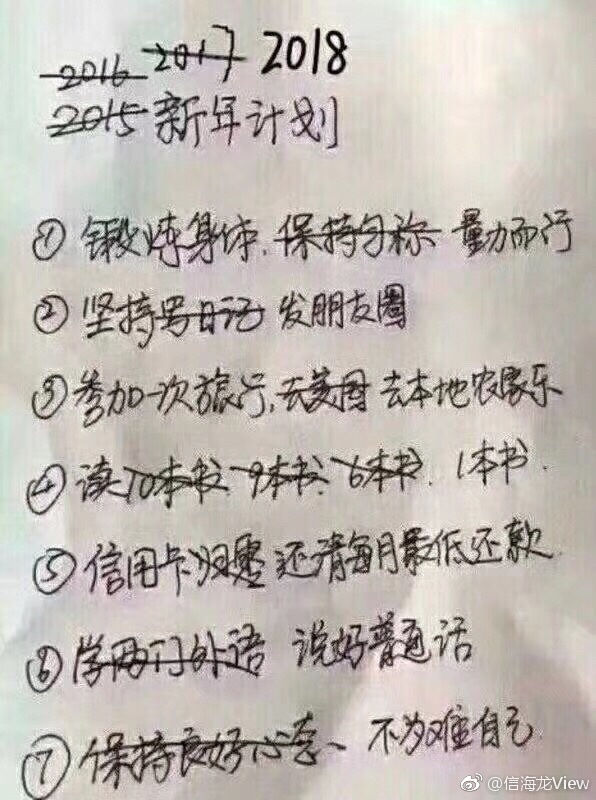

## MIT 6.824: Distributed Systems

2015年读研找完工作的时候就想写这个课程的作业，一拖再拖，直到上班了小一年才写完了Lab1。Lab2-4是一个完整的项目，最终是实现一个分片+副本的kv服务，2015年的是用paxos协议实现的，2017年改成了目前开源中更常见也更容易理解的raft协议，所以2015年的不再更新了。

2015年的作业没有完成是因为摊子铺的太大，原本除了写作业以外，还想完成课堂讲义、作业说明、论文的翻译以及源码分析。但是实际执行过程中发现翻译和源码分析以及写作业中学习Go语言分散了作业本身的精力，课程本身涉及的内容也不仅仅是分布式存储，还包括分布式计算、工业界的各种实现（GFS、Dynamo、Spark）、分布式事务，甚至还包括了Bitcoin。为了保证2017年的作业能顺利完成，做下面三点改进

1. 通过完成Lab2-4学习并实践raft原理，避免贪多嚼不烂
2. 翻译raft论文、相关的课堂讲义和FAQ，作业说明不翻译。
3. 除此以外的论文和课堂讲义等完成Lab2-4以后再说，2017年的课程已经完全变成了每个LEC都需要读一篇论文的case study模式，结合LEC+FAQ精读论文逐个了解。大体顺序如下：
    1. LEC8：ZooKeeper，虽然不是用的raft，但是算是强一致存储的一种应用。
    2. LEC3：GFS
    3. LEC14：Spark
    4. LEC4：primary-backup，主备高可用通常是用在master-slave模式的架构中，对master服务做一主一备，但是备的数据和主不能强一致。

### [2015](http://nil.csail.mit.edu/6.824/2015/)
#### LEC
* [LEC 1: Introduction](2015/LEC/1.md)
* [LEC 2: RPC and Threads](2015/LEC/2.md)

#### Lab
* [Lab 1: MapReduce](2015/Lab/1.md)
* [Lab 2: Primary/Backup Key/Value Service](2015/Lab/2.md)

#### Solution
* [Lab 1: MapReduce](2015/Solution/1.md)

### [2017](http://nil.csail.mit.edu/6.824/2017/)
#### Solution
* [Lab 1: MapReduce](2017/Solution/lab1.md)